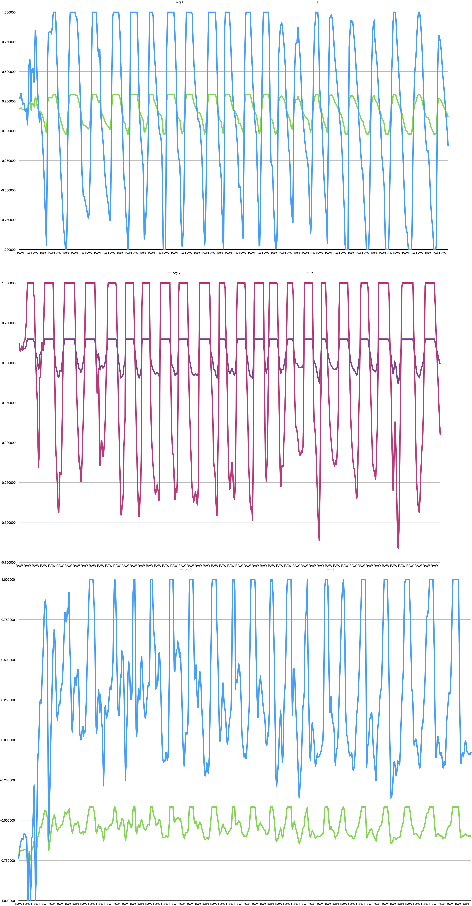

Copyright © 2024 Artemis Tack. This work is licensed under CC BY-NC-SA 4.0

---

# Introduction

After the last lab, this lab was honestly a breath of fresh air. I was (almost) able to do it all in the two labs with no outside class. I did work on it for about an hour outside of class, but I think that, if I was speeding, I could have done it all within those two lab periods. I also want to thank [IAm-Ky229](https://github.com/IAm-Ky229) on Github for their lab08 code. Again, I tried not to directly copy anything, but I was inspired enough by it that I wanted to give them a shoutout!

# Looking at some pretty janky code 

## Special characters - a struggle

I thought that it would be pretty cool if it printed ɷ (I can’t get it to output here, but imagine a character that kinda looks like a ghost from Pacman) instead of an A. But I couldn’t get it to work for whatever reason. Even though I _know_ that my terminal font supports that character. I mean, this document is in that font, MesloLGS NF.

From what I found online and through GitHub Copilot, it looked like something called `wncurses.h` was what was needed. But I couldn’t figure out how to get that working. So I just decided to go with a 0 instead because I thought that it looked better than an A. 

## I’m late, I’m late, for a very important date!
pt. 1 q 2 I belive.

I really don’t like having to deal with reading in time from the controller. Plus, I had already gotten a lot of it done before I realized that I kinda had to, and I didn’t want to change all the scanf statements. So instead of reading time in from the controller, I just created a simple timer in C. 

```c
    struct timeval last_action_time;
    gettimeofday(&last_action_time, NULL);
```

```c
    struct timeval current_time;
    gettimeofday(&current_time, NULL);

    long elapsed_time = (current_time.tv_sec - last_action_time.tv_sec) * 1000L + 
                        (current_time.tv_usec - last_action_time.tv_usec) / 1000L;
```

Basically what it’s doing is comparing two times, the current time and the value of the `last_action_time`. And then setting that difference to `elapsed_time`. I have later in my code that if the `elapsed_time > 500`, in other words if it’s been more than 500 ms than the last “action”, that it would iterate. 

## Moving the avatar
pt. 2 q 1

This is probably some of the simplist code for a kinda complex thing that I’ve written so far for this class. 

```c
    if (elapsed_time >= 500) {
        /* Calculate the roll of the DS4 controller using the moving average */

        double roll = m_avg(fun_gx, NUM_SAMPLES, gx);

        roll = roll * -1;

        /* Update the avatar position based on the roll */

        if (MAZE[x][y+1] != WALL)
        {
            y++;
            gx = 0;
        }

        if (roll > .2 && x < COLUMNS - 1 && MAZE[x+1][y] != WALL)
        {
            x++;
            gx = 0;
        }
        else if (roll < .2 && x > 0 && MAZE[x-1][y] != WALL)
        {
            x--;
            gx = 0;
        }
```

So it takes the roll, or how much you’re moving the controller from left to right, and assings that value to the roll. If the `MAZE[][]` isn’t a wall, it will automatically go down by 1 “pixel”. If the roll is greater than .2 and the spot to the right isn’t a wall the avatar will move to the right. On the oposite side of the scale, if the roll is less than .2 and the spot to the left isn’t a wall then it’ll move to the left. 

## Exiting the maze
pt. 2 q 1

What works:

```c
        if (MAZE[x+1][y] == WALL && MAZE[x-1][y] == WALL && MAZE[x][y+1] == WALL) {
            printf("YOU LOSE!\n");
            loose = 1;
            exit_loop = 1;
            break;
        }
```

Basically, since the lab instructions were really specific, I just had to check if the pixels to the imediate right, left, and bottom were walls. If it checked all those boxes it’ll print “YOU LOSE!” and then it’ll exit the loop, and thus the program. 

What didn’t work:

```c

        if (MAZE[x][y+1] == WALL || MAZE[x+1][y] == WALL || MAZE[x-1][y] == WALL) {
            for (int i = 0; i < COLUMNS; i++)
            {
                if (MAZE[i][y+1] == WALL) {
                    for (int j = 0; j < 1; j++)
                    {
                        if (MAZE[i][j+1] == EMPTY_SPACE && MAZE[i][j] == EMPTY_SPACE) {
                            exit_if = 1;
                            break;
                        }
                }
                if (exit_if == 0) {
                    printf("YOU LOSE!\n");
                    loose = 1;
                    exit_loop = 1;
                    break;
                }
                else if (exit_if == 1) {
                    break;
                }
            }
            }
        }

```

The logic is that if the pixel underneath is a wall, or the pixel to the right or left is a wall, it’ll enter the first for loop. That loop will iterate for all columns, and if the pixel underneath is a wall it’ll enter a second for loop. That for loop checks for 1 row if any rows on the x-axis is empty space. If it is then it’ll break. 

I think the problem is that it checks for every pixel on both the columns and rows, so a 80x2 grid. And if pretty much any two pixels in a horizontal row is empty space then it’ll exit the loop, even if it can’t get to it. I think it _should_ in theory at least, be pretty easy to fix, I’m just not sure how, and at the time of this writting I don’t really feel like figuring it out. It’s good enough, and that’s good enough for me. 

## imo a kinda useless moving average
pt. 1 q 1

The moving average itself: 

```c
double m_avg(double buffer[], int avg_size, double new_item)
{
    // Calculating the moving average of the buffer
    double sum = 0.0;
    int i = 0;

    // Shift the buffer to the left
    
    for (i = 0; i < avg_size - 1; i++)
    {
        buffer[i] = buffer[i + 1];
    }

    buffer[avg_size -1] = new_item;

    for(i = 0; i < avg_size; i++)
    {
        sum += buffer[i];
    }

    // Return the average

    return sum / (avg_size + 1);
}
```

The difference between the raw data and the averaged data in my graph for part A is that the average is going to be smoother than the raw data because it’s averaging the data across a period of time. For me, I set the buffer in lab08 to 1, so it was basically just reading the data in real time, making it pretty useless. 

The reason that i did this was because I thought that it would be a pretty anoying UX if it felt “floaty” because the movement on screen didn’t exactly match the movement that the player was doing with the controller. 




